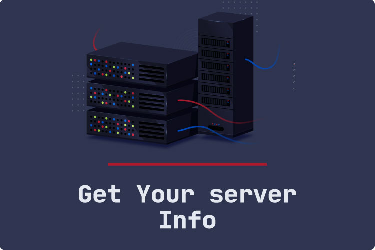

[](https://packagist.org/packages/somarkn99/Server-Info)
[](https://github.com/somarkn99/Server-Info/stargazers)
[](https://github.com/Syrian-Open-Source/laravel-short-artisan/issues)
[](https://github.com/somarkn99/Server-Info/network)



# Server Info Package

This package provides a set of key information about your server in order to view it to the user.

## Installation

You can install the package via composer:

```php
composer require somarkn99/host-info
```

## Config

copy path to config/app.php:

```php
Somarkn99\HostInfo\Providers\HostInfoProvider::class
```


Usage
-------
After you Install package and upload to you host, you will have this route:

```php
www.your-domain.com/api/server/info
```

When you request the endpoint it will return array:

- ✅ Server OS
- ✅ Server Software
- ✅ Server IP
- ✅ Server Port
- ✅ Server Country
- ✅ Server City
- ✅ Server Hostname
- ✅ Document Root
- ✅ Total CPUs
- ✅ Total Ram
- ✅ PHP Version
- ✅ PHP Max Upload Size
- ✅ PHP Max Execution Time
- ✅ PHP Short Tag
- ✅ PHP Memory Limit

Where you can use this ? :thinking:	
-------
The idea for this came when one of my clients asked me to access the basic server information from the control panel, now you can show it to the user easily instead of writing it in every new project from the beginning.

Note :warning:	
-------
Not all of these codes have to be from my pure work, there are many of them on the Internet that I may have done some but not limited to some modification, improvement, or modification of the appearance of the code to become readable, understandable or appropriate to the place of use.
If you have any code you think will be useful and people will use frequently in many projects do not hesitate to do a pull request to this repo.

Let's Connect
-------

- [Linkedin](https://www.linkedin.com/in/somarkn99/)
- [website](https://www.somar-kesen.com/)
- [facebook](https://www.facebook.com/SomarKesen)
- [instagram](https://www.instagram.com/somar_kn/)

Hire Me :fire:
-------
By the way, I'm available to work as freelancer, feel free to communicate with me in order to transform your project from an idea to reality.

You Can contact me for freelancer job vie email :
```
freelancer@somar-kesen.com
```

Security
--------

If you discover any security related issues, please email them first to contact@somar-kesen.com,
if we do not fix it within a short period of time please open a new issue describe your problem.
